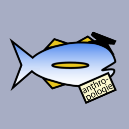

# FSH Boba Shop POS System (project3-team03)

A full-stack, web-based Point of Sale (POS) system designed for a modern and ocean-themed boba shop. This application supports manager, cashier, self-service kiosk, and menu board workflows, integrating a Node.js backend with a PostgreSQL database and EJS-based frontend.

<p align="left">
  
</p>

## Link to the starting page
https://project3-team03-mkg4.onrender.com/

## Features
### Ordering System
- Cashier POS interface
- Self-service kiosk
- Menu board view
- Customizable drinks (ice, sugar, add-ons)
- Quiz-based drink recommendation (extra feature)
- Dynamic drink art (extra feature)
- API integrations for accessibility and above and beyond features

### Manager Dashboard
- Sales metrics (daily revenue, avg order, etc.)
- Recent orders overview
- Add / update / delete ingredients
- Add / update / delete menu items and drink designs
- Reports
  - X-Report (live session)
  - Z-Report (end-of-day closeout)
  - Sales report (date range)
  - Product usage analytics
- Employee Management
  - Add employees
  - Update roles and wages
  - Activate/deactivate employees

## Tech Stack
- Frontend: EJS, HTML, CSS
- Backend: Node.js, Express
- Database: PostgreSQL
- Architecture: MVC-style (routes + views + DAO/database layer)

## Running Locally

**1. Install dependencies**
```bash
npm install
```

**2. Start the app**
```bash
npm start
```

**3. Open in browser (default)**
```
http://localhost:3000
```

**If something breaks...** try reinstalling:
```bash
rm -rf node_modules
npm install
npm audit fix
```

## Team
Developed as part of a software engineering project by Team 03:
- Ahmed Albsharat
- Aseem Awasthy
- Eduardo Diaz
- Maximus Marin
- Kenneth Robbins
